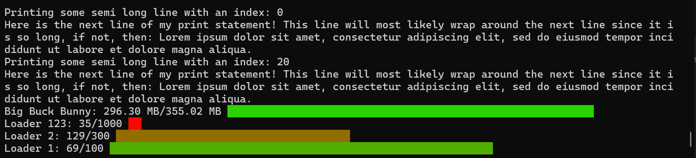

<!-- README template by othneildrew -->
<!-- Improved compatibility of back to top link: See: https://github.com/othneildrew/Best-README-Template/pull/73 -->

[![Contributors][contributors-shield]][contributors-url]
[![Forks][forks-shield]][forks-url]
[![Stargazers][stars-shield]][stars-url]
[![Issues][issues-shield]][issues-url]
[![project_license][license-shield]][license-url]

<!-- PROJECT LOGO -->
 

  

<h3 align="center">RCli-Loader</h3>

  

    RCli-Loader - CLI loading interface, written in Rust!
    <!--  
    <a href="https://github.com/nikguin04/rcli-loader"><strong>Explore the docs »</strong></a>
     
     
    <a href="https://github.com/nikguin04/rcli-loader">View Demo</a>
    &middot;-->
     
    <a href="https://github.com/nikguin04/rcli-loader/issues/new?labels=bug&template=bug-report---.md">Report Bug</a>
    &middot;
    <a href="https://github.com/nikguin04/rcli-loader/issues/new?labels=enhancement&template=feature-request---.md">Request Feature</a>
  

<!-- TABLE OF CONTENTS -->

  
Table of Contents

  <ol>
    <li>
      <a href="#about-the-project">About The Project</a>
      <ul>
        <li><a href="#built-with">Built With</a></li>
      </ul>
    </li>
    <li>
      <a href="#getting-started">Getting Started</a>
      <!-- <ul>
        <li><a href="#prerequisites">Prerequisites</a></li>
        <li><a href="#installation">Installation</a></li>
      </ul> -->
    </li>
    <li><a href="#usage">Usage</a></li>
    <!-- <li><a href="#roadmap">Roadmap</a></li>-->
    <li><a href="#contributing">Contributing</a></li>
    <li><a href="#license">License</a></li>
    <li><a href="#contact">Contact</a></li>
    <!-- <li><a href="#acknowledgments">Acknowledgments</a></li>  -->
  </ol>

<!-- ABOUT THE PROJECT -->
## About The Project

[![rcli-loader product screenshot][product-screenshot]](https://github.com/nikguin04/rcli-loader)

The RCLI-Loader crate **(coming soon)** is a Rust CLI manager built for versatile monitoring of the progress for running tasks, either quick or slow!
  A screenshot for an examplified implementation of the features can be seen below, including:
 - Names
 - Progress indicator (numbered)
    - Also features providing a scaling function for conversion of any wanted unit!
 - Progress indicator (block characters)
    - Scaling perfectly to the terminal size to give maximal precision (8 blocks per character available)!
 - Fully customizable colors for individual loading elements
    - Provide a custom function, or use an already created one, for determining the color setup of the loading elements.
    - Note: Currently only the numbered progress indicator supports colors
 - Custom alignment for loading elements: Place either aligning with top or bottom of terminal
 - Custom print function for logging, without overwriting the loading elements.
    - Currently only works when aligning loading elements at bottom.
    - Scrollback buffer will never work with top alignment as no terminal has features to handle this without very suboptimal and slow workarounds. 

Even more features are coming, and feature requests are welcome: read <a href="#contributing">Contributing</a>

(<a href="#readme-top">back to top</a>)

### Built With

* [![Rust][Rust]][Rust-url]

(<a href="#readme-top">back to top</a>)

<!-- GETTING STARTED -->
## Getting Started
<!--

### Prerequisites

### Installation-->

#### Running example
1. git clone https://github.com/nikguin04/rcli-loader.git
2. cd rcli-loader
3. cargo run --example basic_example --all-features

#### Implementing crate for your own project!
Coming soon

(<a href="#readme-top">back to top</a>)

<!-- USAGE EXAMPLES -->
## Usage

Usage coming soon™

(<a href="#readme-top">back to top</a>)

<!-- ROADMAP -->
<!--## Roadmap

- [ ] Feature 1
- [ ] Feature 2
- [ ] Feature 3
    - [ ] Nested Feature

See the [open issues](https://github.com/nikguin04/rcli-loader/issues) for a full list of proposed features (and known issues).

(<a href="#readme-top">back to top</a>)
-->

<!-- CONTRIBUTING -->
## Contributing

Currently i am the only contributor and maintainer of this project. Contributions of any kind are very welcome.

If you have any improvements please fork the repo and create a pull request here. Please make sure to properly describe any changes made in the pull request, so i am not 100% reliant on commit names, which usually are a bit messy ;)  
If this project has helped you, please give it a star!

(<a href="#readme-top">back to top</a>)

<!-- ### Top contributors:

 -->

<!-- LICENSE -->
## License

Distributed under the GNU General Public License v3.0 license. See `LICENSE.txt` for more information.

(<a href="#readme-top">back to top</a>)

<!-- CONTACT -->
## Contact

For any contact regarding this repo, please contact me through email at nikguin04@proton.me or on the Discussions on this repository 
Project Link: [https://github.com/nikguin04/rcli-loader](https://github.com/nikguin04/rcli-loader)

(<a href="#readme-top">back to top</a>)

<!-- ACKNOWLEDGMENTS -->
<!--## Acknowledgments

* 
* 
* 

(<a href="#readme-top">back to top</a>)
-->

<!-- MARKDOWN LINKS & IMAGES -->
<!-- https://www.markdownguide.org/basic-syntax/#reference-style-links -->
[contributors-shield]: https://img.shields.io/github/contributors/nikguin04/rcli-loader.svg?style=for-the-badge
[contributors-url]: https://github.com/nikguin04/rcli-loader/graphs/contributors
[forks-shield]: https://img.shields.io/github/forks/nikguin04/rcli-loader.svg?style=for-the-badge
[forks-url]: https://github.com/nikguin04/rcli-loader/network/members
[stars-shield]: https://img.shields.io/github/stars/nikguin04/rcli-loader.svg?style=for-the-badge
[stars-url]: https://github.com/nikguin04/rcli-loader/stargazers
[issues-shield]: https://img.shields.io/github/issues/nikguin04/rcli-loader.svg?style=for-the-badge
[issues-url]: https://github.com/nikguin04/rcli-loader/issues
[license-shield]: https://img.shields.io/github/license/nikguin04/rcli-loader.svg?style=for-the-badge
[license-url]: https://github.com/nikguin04/rcli-loader/blob/master/LICENSE.txt
[product-screenshot]: .readme/FerrisSplash.png
[Rust]: https://img.shields.io/badge/Rust-%23F74C00.svg?e&logo=rust&logoColor=white
[Rust-url]: https://www.rust-lang.org/